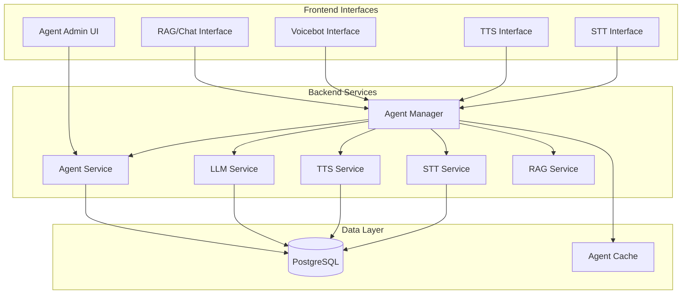

# Agent Management System Implementation Plan

## Overview

This document outlines the implementation plan for a comprehensive agent management system that replaces the current environment variable-based provider configuration with a dynamic, database-backed multi-agent system.

## Current Architecture Analysis

### Current Provider Initialization Pattern

```python
# Current pattern in services
class TTSService:
    def __init__(self):
        self.config = tts_config  # Static config from .env
        self.provider = self._initialize_provider()
    
    def _initialize_provider(self):
        provider_name = self.config.get_provider()
        if provider_name == "async.ai":
            self.provider = AsyncAIProvider()
        # ... other providers
```

### Key Integration Points
- **LLM Service**: [`src/voicebot_app/services/llm/llm.py`](src/voicebot_app/services/llm/llm.py:18)
- **TTS Service**: [`src/voicebot_app/services/tts/tts.py`](src/voicebot_app/services/tts/tts.py:24)
- **STT Service**: [`src/voicebot_app/services/stt/stt.py`](src/voicebot_app/services/stt/stt.py:25)
- **Voicebot Service**: [`src/voicebot_app/services/voicebot_wrapper/voicebot_service.py`](src/voicebot_app/services/voicebot_wrapper/voicebot_service.py:100)

## Target Architecture

### System Architecture



### Database Schema Design

```sql
-- Users table (prepared for future IAM)
CREATE TABLE users (
    id UUID PRIMARY KEY DEFAULT gen_random_uuid(),
    username VARCHAR(255) UNIQUE NOT NULL,
    email VARCHAR(255) UNIQUE NOT NULL,
    created_at TIMESTAMP DEFAULT CURRENT_TIMESTAMP,
    updated_at TIMESTAMP DEFAULT CURRENT_TIMESTAMP
);

-- Agents table
CREATE TABLE agents (
    id UUID PRIMARY KEY DEFAULT gen_random_uuid(),
    user_id UUID REFERENCES users(id) ON DELETE CASCADE,
    name VARCHAR(255) NOT NULL,
    description TEXT,
    is_default BOOLEAN DEFAULT FALSE,
    is_active BOOLEAN DEFAULT TRUE,
    
    -- Provider configurations (JSONB for flexibility)
    llm_provider_config JSONB NOT NULL DEFAULT '{}',
    tts_provider_config JSONB NOT NULL DEFAULT '{}',
    stt_provider_config JSONB NOT NULL DEFAULT '{}',
    
    -- Metadata
    created_at TIMESTAMP DEFAULT CURRENT_TIMESTAMP,
    updated_at TIMESTAMP DEFAULT CURRENT_TIMESTAMP
);

-- Indexes for performance
CREATE INDEX idx_agents_user_id ON agents(user_id);
CREATE INDEX idx_agents_is_default ON agents(is_default) WHERE is_default = TRUE;
CREATE INDEX idx_agents_is_active ON agents(is_active) WHERE is_active = TRUE;

-- Constraint: Only one default agent per user
CREATE UNIQUE INDEX idx_agents_user_default ON agents(user_id) WHERE is_default = TRUE;
```

### Agent Configuration Structure

```json
{
  "llm_provider_config": {
    "provider": "groq.com",
    "api_key": "sk_...",
    "model": "llama-3.1-8b-instant",
    "api_url": "https://api.groq.com",
    "completions_path": "/openai/v1/chat/completions"
  },
  "tts_provider_config": {
    "provider": "async.ai",
    "api_key": "sk_...",
    "voice_id": "e7b694f8-d277-47ff-82bf-cb48e7662647",
    "model_id": "asyncflow_v2.0",
    "sample_rate": 44100
  },
  "stt_provider_config": {
    "provider": "whisper.local",
    "url": "ws://whisper-stt:8003",
    "path": "/api/stt/stream"
  }
}
```

## Implementation Phases

### Phase 1: Database & Core Infrastructure
1. **PostgreSQL Setup**
   - Add PostgreSQL to docker-compose
   - Configure database connection
   - Set up Alembic for migrations

2. **Core Agent Models**
   - Create SQLAlchemy models
   - Implement AgentService with CRUD operations
   - Create AgentManager for runtime resolution

### Phase 2: Service Integration
3. **Update Service Factories**
   - Modify LLM/TTS/STT services to accept agent configuration
   - Create provider factories that use agent config instead of .env
   - Implement runtime provider switching

4. **Agent Management API**
   - Create REST endpoints for agent CRUD operations
   - Implement default agent management
   - Add agent selection endpoints

### Phase 3: Interface Updates
5. **Update Existing Interfaces**
   - RAG/Chat interface: Add agent selection dropdown
   - Voicebot interface: Add agent switching capability
   - TTS/STT interfaces: Support agent-based configuration

6. **Admin Interface**
   - Create agent management UI
   - Implement provider configuration forms
   - Add agent testing functionality

### Phase 4: Testing & Migration
7. **Default Dev Agent**
   - Create agent from .env on startup
   - Maintain test compatibility
   - Provide migration path

8. **Comprehensive Testing**
   - Update existing tests
   - Add agent management tests
   - Test runtime agent switching

## Detailed Implementation Steps

### 1. Database Setup

**Files to create:**
- [`src/voicebot_app/database/__init__.py`](src/voicebot_app/database/__init__.py)
- [`src/voicebot_app/database/models.py`](src/voicebot_app/database/models.py)
- [`src/voicebot_app/database/session.py`](src/voicebot_app/database/session.py)
- [`alembic/versions/`](alembic/versions/) (migration files)

### 2. Agent Service Layer

**Core Components:**
- [`src/voicebot_app/services/agent/agent_service.py`](src/voicebot_app/services/agent/agent_service.py)
- [`src/voicebot_app/services/agent/agent_manager.py`](src/voicebot_app/services/agent/agent_manager.py)
- [`src/voicebot_app/services/agent/models.py`](src/voicebot_app/services/agent/models.py)

### 3. Updated Service Factories

**Key Changes:**
```python
# New pattern for services
class TTSService:
    def __init__(self, agent_id: Optional[str] = None):
        self.agent_manager = AgentManager()
        self.agent_id = agent_id
        self.provider = self._initialize_provider()
    
    def _initialize_provider(self):
        agent_config = self.agent_manager.get_agent_config(self.agent_id)
        provider_name = agent_config.tts_provider
        
        if provider_name == "async.ai":
            return AsyncAIProvider(agent_config.tts_config)
        # ... other providers
```

### 4. API Endpoints

**New Routes:**
- `GET /api/agents` - List agents
- `POST /api/agents` - Create agent
- `GET /api/agents/{agent_id}` - Get agent details
- `PUT /api/agents/{agent_id}` - Update agent
- `DELETE /api/agents/{agent_id}` - Delete agent
- `POST /api/agents/{agent_id}/set-default` - Set as default
- `GET /api/agents/current` - Get current agent

### 5. Frontend Integration

**Interface Updates:**
- Add agent selection dropdown to all interfaces
- Implement agent switching without page reload
- Add agent management modal/pages

## Migration Strategy

### Step 1: Dual Configuration Support
- Maintain .env compatibility during transition
- Services check for agent_id first, fallback to .env

### Step 2: Default Agent Creation
- Create "Development Agent" from .env on first run
- All existing tests use this default agent

### Step 3: Gradual Migration
- Update interfaces one by one
- Test each integration thoroughly
- Remove .env fallback once stable

## Technical Considerations

### Performance
- Implement agent configuration caching
- Use connection pooling for database
- Optimize provider initialization

### Security
- Encrypt sensitive provider keys in database
- Implement user-based agent access control
- Add rate limiting for agent operations

### Scalability
- Design for multi-tenant architecture
- Support horizontal scaling
- Implement efficient agent resolution

## Success Metrics

- ✅ Agents can be created/updated/deleted at runtime
- ✅ Provider configurations persist across restarts
- ✅ All interfaces support agent switching
- ✅ Backward compatibility for development/testing
- ✅ Performance: <100ms agent switching
- ✅ Reliability: No service interruption during agent changes

## Next Steps

1. Review and approve this architecture
2. Begin Phase 1 implementation (Database & Core)
3. Iterate through each phase with testing
4. Deploy to production once all phases complete

This plan provides a solid foundation for a robust, scalable agent management system that meets all specified requirements.