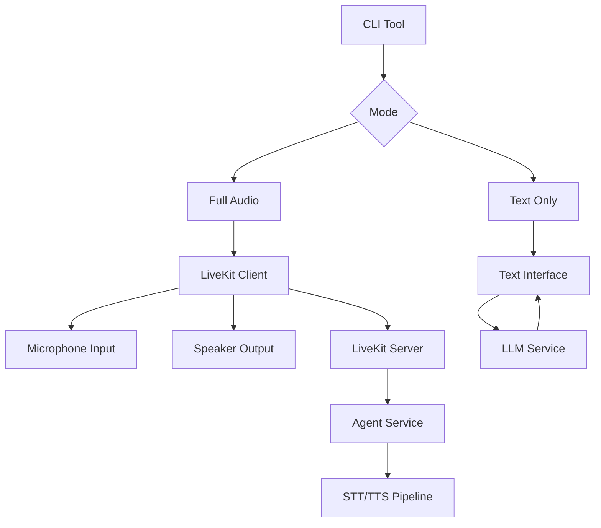

# Plan d'Intégration LiveKit et CLI

## 1. Intégration Docker Compose

### Modification de `docker-compose.yml`
Ajouter les services LiveKit au fichier principal :

```yaml
services:
  # Services existants...
  livekit:
    extends:
      file: ./docker-compose.livekit.yml
      service: livekit
    networks:
      - voicebot-network
    env_file:
      - .env

  redis:
    extends:
      file: ./docker-compose.livekit.yml
      service: redis
    networks:
      - voicebot-network

  sip:
    extends:
      file: ./docker-compose.livekit.yml
      service: sip
    networks:
      - voicebot-network
```

### Configuration Réseau
- LiveKit Server sur le réseau `voicebot-network`
- Ports exposés : 7880 (HTTP), 7881 (HTTPS), 7882/UDP (WebRTC)
- Redis pour la persistance des sessions

## 2. Outil CLI pour Tester les Agents

### Architecture du CLI
```
src/cli/
├── __init__.py
├── main.py          # Point d'entrée principal
├── agent_runner.py  # Logique d'exécution des agents
├── audio_input.py   # Gestion microphone
├── text_input.py    # Gestion clavier
└── livekit_client.py # Client LiveKit pour CLI
```

### Interface de Commande
```bash
# Mode audio complet avec LiveKit
python -m src.cli.main --agent-name "etienne" --mode full

# Mode texte uniquement (sans audio)
python -m src.cli.main --agent-name "etienne" --mode text

# Options supplémentaires
python -m src.cli.main --agent-name "etienne" --mode full --room-name "test-room" --verbose
```

### Fonctionnalités du CLI

#### Mode "full" (Audio)
- Connexion automatique à LiveKit Server
- Capture audio microphone en temps réel
- STT → LLM → TTS pipeline complet
- Gestion des sessions WebRTC

#### Mode "text" (Texte)
- Interface conversationnelle texte uniquement
- Pas de dépendance audio
- Idéal pour debugging et développement

### Implémentation Technique

#### Gestion des Modes
```python
class CLIMode(Enum):
    FULL = "full"    # Audio via LiveKit
    TEXT = "text"    # Texte uniquement
```

#### Client LiveKit CLI
- Utilise le SDK LiveKit Python
- Gère la connexion aux salles
- Capture et envoi audio
- Réception et lecture audio

#### Gestion Audio
- Utilise `pyaudio` ou `sounddevice` pour capture
- Bufferisation en temps réel
- Intégration avec notre service STT existant

## 3. Workflow d'Exécution

### Démarrage
```bash
# 1. Démarrer tous les services
docker compose up -d

# 2. Tester un agent en mode texte
python -m src.cli.main --agent-name "etienne" --mode text

# 3. Tester en mode audio complet
python -m src.cli.main --agent-name "etienne" --mode full
```

### Flux de Données CLI


## 4. Dépendances et Configuration

### Dépendances Python
- `livekit-api` - SDK LiveKit Python
- `pyaudio` ou `sounddevice` - Capture audio
- `argparse` - Gestion des arguments CLI
- `asyncio` - Programmation asynchrone

### Variables d'Environnement
```bash
LIVEKIT_URL=ws://localhost:7880
LIVEKIT_API_KEY=devkey
LIVEKIT_API_SECRET=secret
AGENT_SERVICE_URL=http://voicebot-app:8001
```

## 5. Avantages de Cette Solution

### Pour les Développeurs
- **Tests rapides** sans interface web
- **Debugging facile** des agents
- **Intégration continue** automatisable

### Pour l'Architecture
- **Unification Docker** - un seul `docker compose up`
- **Séparation des concerns** - CLI vs Web
- **Extensibilité** - nouveaux modes facilement ajoutables

## 6. Prochaines Étapes

1. **Modifier `docker-compose.yml`** (nécessite mode Code)
2. **Créer la structure CLI** dans `src/cli/`
3. **Implémenter le client LiveKit CLI**
4. **Ajouter la gestion audio/text**
5. **Tester et documenter**

Cette approche permettra de tester rapidement les agents depuis le terminal tout en bénéficiant de l'infrastructure LiveKit robuste.