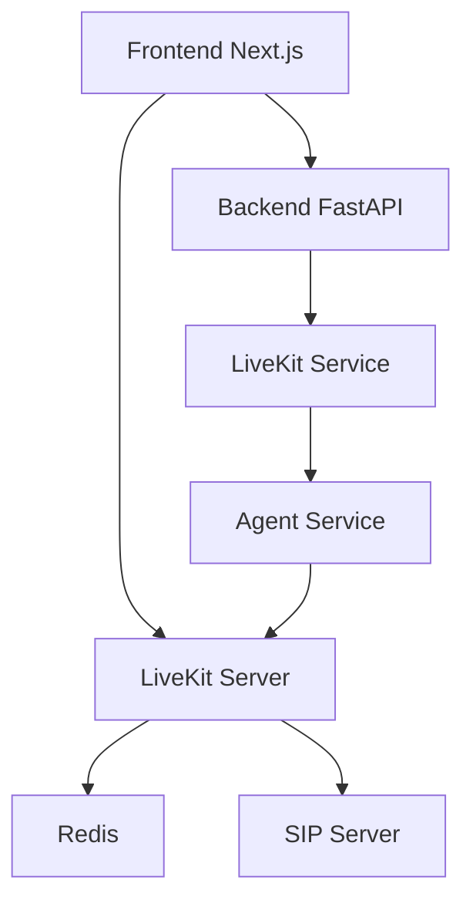

# Guide d'Intégration LiveKit - Voicebot

## Architecture Finale



## Composants Créés

### 1. Infrastructure LiveKit
- [`docker-compose.livekit.yml`](docker-compose.livekit.yml) - Configuration Docker validée
- Serveur LiveKit + Redis + SIP

### 2. Backend LiveKit
- [`src/services/livekit/livekit_service.py`](src/services/livekit/livekit_service.py) - Service principal
- [`src/services/livekit/routes.py`](src/services/livekit/routes.py) - API endpoints
- [`src/services/livekit/__init__.py`](src/services/livekit/__init__.py) - Module

### 3. Frontend LiveKit
- [`src/front/lib/livekit-client.ts`](src/front/lib/livekit-client.ts) - Client LiveKit
- [`src/front/package.json`](src/front/package.json) - Dépendances LiveKit

## Workflow de Connexion

### 1. Frontend → Backend
```typescript
// Créer une salle pour l'agent
const response = await fetch('/api/livekit/create-room', {
  method: 'POST',
  body: JSON.stringify({ agent_id: 'agent-123' })
});

const { room_name, access_token, livekit_url } = await response.json();
```

### 2. Backend → LiveKit Server
```python
# Créer la salle LiveKit
room_info = await livekit_service.create_room_for_agent(agent_id)

# Notifier l'agent
await livekit_service.notify_agent_to_join(agent_id, room_name)
```

### 3. Frontend → LiveKit Server
```typescript
// Se connecter à la salle
await liveKitClient.connect(agent_id);

// Événements
liveKitClient.onAudioTrack = (stream) => {
  // Jouer l'audio de l'agent
  audioElement.srcObject = stream;
};
```

### 4. Agent → LiveKit Server
```python
# Handler automatique LiveKit
@server.rtc_session()
async def handle_voicebot_session(ctx: JobContext):
    # L'agent rejoint automatiquement la salle
    session = AgentSession(...)
    await session.start(room=ctx.room, agent=agent)
```

## Démarrage Rapide

### 1. Démarrer l'Infrastructure
```bash
docker-compose -f docker-compose.livekit.yml up -d
```

### 2. Vérifier la Santé
```bash
curl http://localhost:7880/health
```

### 3. Installer les Dépendances Frontend
```bash
cd src/front
npm install
```

### 4. Tester la Connexion
```bash
# Tester l'API backend
curl -X POST http://localhost:8001/api/livekit/health
```

## Endpoints API

### Créer une Salle
```http
POST /api/livekit/create-room
Content-Type: application/json

{
  "agent_id": "agent-123"
}
```

### Notifier un Agent
```http
POST /api/livekit/job-notification
Content-Type: application/json

{
  "agent_id": "agent-123",
  "room_name": "voicebot_agent-123_abc123"
}
```

### Vérifier la Santé
```http
GET /api/livekit/health
```

## Configuration

### Variables d'Environnement
```bash
LIVEKIT_URL=ws://livekit:7880
LIVEKIT_API_KEY=devkey
LIVEKIT_API_SECRET=secret
```

### Ports Exposés
- **7880**: HTTP/WebSocket LiveKit
- **7881**: HTTPS/WebSocket LiveKit  
- **7882**: WebRTC UDP LiveKit
- **6379**: Redis
- **5060**: SIP Server

## Résolution des Problèmes

### Problèmes de Connexion ICE
✅ **Résolu par LiveKit**: Le serveur média dédié gère automatiquement le NAT traversal

### Problèmes Audio
- Vérifier les permissions microphone
- Tester avec l'interface de test LiveKit

### Problèmes Réseau
- Vérifier les ports UDP ouverts
- Tester avec différentes configurations ICE

## Prochaines Étapes

1. **Tester l'intégration complète**
2. **Adapter l'interface existante** pour utiliser LiveKit
3. **Migrer progressivement** depuis aiortc
4. **Ajouter le monitoring** et logging
5. **Documenter les cas d'usage** avancés

## Références LiveKit

- [Documentation LiveKit](https://docs.livekit.io/)
- [SDK JavaScript](https://github.com/livekit/client-sdk-js)
- [Agents Python](https://github.com/livekit/agents)
- [MCP Server](https://docs.livekit.io/home/get-started/mcp-server.md)