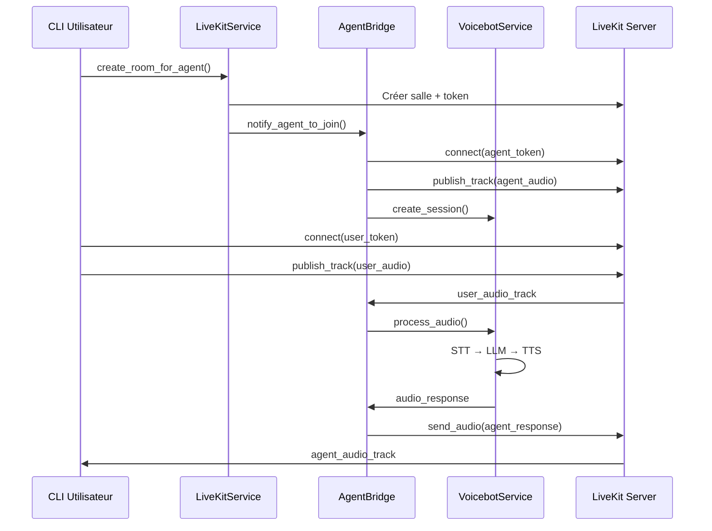

# Plan d'Implémentation pour LiveKit Agent Bridge

## Problème Identifié

Le problème principal est que l'agent bridge actuel n'implémente pas réellement la connexion à LiveKit - il utilise seulement un mode simulation. Le STT n'est pas déclenché car l'agent ne rejoint pas réellement la salle LiveKit.

## Architecture Actuelle Analysée

### 1. Workflow CLI (Fonctionnel)
- [`src/cli/main.py`](src/cli/main.py:145) - Lance le mode full audio via LiveKit
- [`src/cli/agent_runner.py`](src/cli/agent_runner.py:36) - Crée une salle LiveKit et notifie l'agent
- [`src/cli/livekit_client.py`](src/cli/livekit_client.py:36) - Se connecte à LiveKit et publie des tracks audio

### 2. Services LiveKit Existants
- [`src/services/livekit/livekit_service.py`](src/services/livekit/livekit_service.py:74) - `notify_agent_to_join()` notifie l'agent de rejoindre
- [`src/services/livekit/agent_bridge.py`](src/services/livekit/agent_bridge.py) - **VIDE - À RECONSTRUIRE**

### 3. Services Voicebot Existants
- [`src/services/agents/voicebot_service.py`](src/services/agents/voicebot_service.py:106) - `process_audio()` traite l'audio utilisateur
- [`src/services/agents/event_loop.py`](src/services/agents/event_loop.py:107) - `process_audio_chunk()` avec VAD et STT

## Plan de Réimplémentation

### Étape 1: Nouvelle Architecture Agent Bridge

```python
class LiveKitAgentBridge:
    """
    Bridge réel qui connecte notre agent à une salle LiveKit.
    
    Fonctionnalités:
    1. Se connecte à LiveKit en tant que participant agent
    2. Écoute l'audio des utilisateurs dans la salle
    3. Envoie l'audio au VoicebotService pour traitement STT/LLM/TTS
    4. Publie les réponses audio de l'agent dans la salle
    """
```

### Étape 2: Connexion LiveKit Réelle

Reprendre la logique de [`src/cli/livekit_client.py`](src/cli/livekit_client.py:36) mais pour l'agent:

- Utiliser `livekit.rtc.Room()` pour la connexion
- Publier un track audio pour les réponses de l'agent
- S'abonner aux tracks audio des utilisateurs
- Gérer les événements de participants et tracks

### Étape 3: Intégration avec VoicebotService

```python
# Créer une session VoicebotEventLoop pour l'agent
voicebot_service = VoicebotService(...)
event_loop = await voicebot_service.create_session(conversation_id)

# Connecter l'audio entrant de LiveKit au VoicebotService
async def on_user_audio_received(audio_chunk: bytes):
    await voicebot_service.process_audio(conversation_id, audio_chunk)

# Envoyer les réponses audio à LiveKit
async def send_agent_audio(audio_chunk: bytes):
    await agent_audio_source.capture_frame(audio_frame)
```

### Étape 4: Gestion des Événements LiveKit

- **Participant Connected**: Détecter quand un utilisateur rejoint
- **Track Subscribed**: S'abonner aux tracks audio des utilisateurs
- **Track Published**: Publier le track audio de l'agent
- **Disconnected**: Nettoyer les ressources

## Diagramme de Séquence



## Fichiers à Modifier

### 1. [`src/services/livekit/agent_bridge.py`](src/services/livekit/agent_bridge.py) - **RECONSTRUCTION COMPLÈTE**
- Implémenter la connexion réelle à LiveKit
- Gérer les événements audio entrants/sortants
- Intégrer avec VoicebotService

### 2. [`src/services/livekit/livekit_service.py`](src/services/livekit/livekit_service.py:74) - **MODIFICATION**
- Améliorer `notify_agent_to_join()` pour utiliser le nouveau bridge
- Gérer correctement les tokens d'agent

### 3. [`src/services/livekit/routes.py`](src/services/livekit/routes.py) - **VÉRIFICATION**
- S'assurer que les routes API appellent le bon service

## Étapes de Test

1. **Test de Connexion**: Vérifier que l'agent peut rejoindre une salle LiveKit
2. **Test Audio Entrant**: Vérifier que l'agent reçoit l'audio utilisateur
3. **Test STT**: Vérifier que le STT est déclenché sur l'audio reçu
4. **Test Réponse Audio**: Vérifier que l'agent peut envoyer des réponses audio
5. **Test End-to-End**: Conversation complète via CLI

## Dépendances Techniques

- **LiveKit Python SDK**: `livekit.rtc` pour la connexion WebRTC
- **aiortc**: Déjà utilisé dans le projet
- **Services Existants**: STT, TTS, LLM, VAD via VoicebotService

## Risques Identifiés

1. **Synchronisation Audio**: Gérer les formats et fréquences d'échantillonnage
2. **Gestion des Connexions**: Nettoyer proprement les connexions LiveKit
3. **Performance**: Gérer le streaming audio en temps réel
4. **Erreurs Réseau**: Gérer les déconnexions et reconnexions

## Prochaines Actions

1. **✅** Analyser l'architecture existante
2. **✅** Comprendre le workflow CLI
3. **➡️** Passer en mode Code pour implémenter le nouveau AgentBridge
4. Tester l'intégration complète
5. Documenter les API et le déploiement