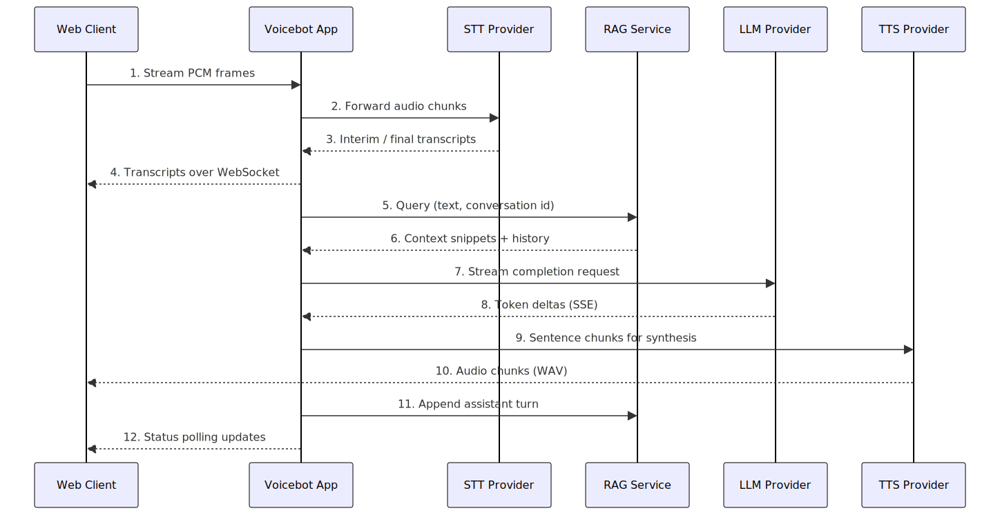

# Voicebot Platform Documentation

> Last updated: 2025-10-09  
> Scope: current end-to-end architecture, runtime flows, and serving options for the Voicebot platform.

This document replaces our previous architecture notes. It captures how the platform is wired today, how the web client and backend coordinate a live call, and which serving stacks we operate or integrate with. Use it as the authoritative map when adding features or onboarding a new deployment.

---

## 1. Platform Overview

| Layer | Services | Responsibilities | Notes |
| --- | --- | --- | --- |
| Client Runtime | Web client (`src/static/**`, `src/web_client.py`) | Microphone capture, audio worklet resampling, ASR streaming via WebSocket, playback state machine. | Runs in browser or thin Electron shell; packaged via `docker/web-client`. |
| Conversation Runtime | Voicebot App (`src/voicebot_app.py`) | Switchable STT/TTS/LLM providers, RAG-backed prompt building, conversation state cache, streaming TTS responses. | Exposes `/api/asr/stream`, `/api/conversation/stream`, `/api/conversation/status`. |
| Knowledge + Memory | RAG Service (`src/rag_service/rag_app.py`) + Qdrant | Document ingestion, semantic & lexical retrieval, conversation memory persistence. | Qdrant acts as both vector DB and similarity engine. |
| Model Serving | Whisper STT, Coqui XTTS, TensorRT-LLM, Llama.cpp, External APIs | Provide inference endpoints for STT, TTS, and LLM workloads. | Each service has its own docker recipe under `docker/**`. |

### High-Level Call Flow
1. **Capture & Stream** – Browser captures audio, resamples to 16 kHz, streams PCM frames over `/api/asr/stream` (`src/static/index.html` & `src/static/audio-processor.js`).
2. **Speech Recognition** – Voicebot App fan-outs audio to the configured STT provider (`src/voicebot_app.py:693-756`) and relays interim/final transcripts to the client.
3. **Grounded Response** – Final transcript triggers `/api/conversation/stream`. Voicebot App gathers RAG context (`src/voicebot_app.py:870-940`), calls the LLM (`src/voicebot_app.py:962-1012`), streams synthesized audio chunks back.
4. **Playback & Interruptions** – Web client plays the WAV stream and monitors for user interruptions (`src/static/index.html:551-639`), restarting the listening loop if speech is detected mid-playback.
5. **Conversation Memory** – Voicebot App appends assistant turns to RAG (`src/voicebot_app.py:1166-1174`), keeping future prompts grounded.

---

## 2. Conversation Runtime

### 2.1 Shared Contracts (Voicebot App ↔ Web Client)

| Endpoint | Direction | Purpose | Key Payload Fields |
| --- | --- | --- | --- |
| `GET /health` | Client → Voicebot | Liveness check before enabling UI controls (`src/static/index.html:676-684`). | `{status, service}` |
| `WS /api/asr/stream` | Client ↔ Voicebot | Full-duplex PCM streaming with interim/final transcripts (`src/voicebot_app.py:1235-1340`). | Binary PCM frames; JSON transcripts `{transcript, is_final}`. |
| `GET /api/conversation/stream` | Client → Voicebot | Request grounded response audio. Returns streaming WAV (`src/voicebot_app.py:1185-1210`). | Query params: `text`, `conversation_id`, `voice_name`, `language_code`. |
| `GET /api/conversation/status/{id}` | Client → Voicebot | Poll response text/complete flag for UI preview (`src/voicebot_app.py:1177-1182`). | `{text, complete}`. |

### 2.2 Voicebot App (Backend Runtime)

- **Provider Abstractions:** Environment toggles pick STT, TTS, and LLM backends at runtime (`src/voicebot_app.py:120-214`). Each capability is wrapped behind a provider interface (STT providers in `src/voicebot/stt/providers.py`, TTS providers in `src/voicebot/tts/providers.py`, LLM streaming override via OpenAI-compatible HTTP in `src/voicebot_app.py:962-1113`) so we can transparently switch between self-hosted services and external APIs.
- **Streaming STT:** Delegated to provider implementations with energy-based VAD for chunking (`voicebot/stt/providers.py:120-205`, `voicebot/stt/providers.py:340-439`).
- **RAG Integration:** Builds prompts with retrieved contexts and prior conversation turns (`src/voicebot_app.py:870-940`); appends assistant turns asynchronously (`src/voicebot_app.py:1166-1174`).
- **LLM Streaming Bridge:** Consumes OpenAI-compatible deltas and chunks them for low-latency TTS while tracking sentence boundaries via `SentenceAccumulator` (`src/voicebot_app.py:334-360`, `src/voicebot_app.py:962-1113`).
- **TTS Streaming:** Provider abstraction supports Riva gRPC, Coqui REST streaming, or external APIs (`src/voicebot_app.py:512-643`, `voicebot/tts/providers.py`).
- **State Cache:** Maintains a TTL-based status cache for client polling (`src/voicebot_app.py:321-327`, `src/voicebot_app.py:1042-1150`).

**Streaming Mechanics**

- **ASR fan-out:** The `/api/asr/stream` websocket ingests raw PCM frames from the browser and pipes them directly into the chosen `StreamingSttProvider`, yielding interim and final transcripts as soon as the backend emits them (`src/voicebot_app.py:1259-1321`). Whisper is accessed via websocket passthrough, while Riva and REST providers run through the same protocol abstraction; REST fallbacks rely on the energy-based VAD to flush buffered audio greedily to keep latency low (`voicebot/stt/providers.py:120-205`, `voicebot/stt/providers.py:340-439`).
- **Token-to-speech loop:** LLM deltas are streamed over Server-Sent Events and appended to a `SentenceAccumulator` that releases natural sentence-sized batches; each batch is immediately sent to the active TTS provider which streams audio frames back to the client (`src/voicebot_app.py:334-360`, `src/voicebot_app.py:962-1160`, `voicebot/tts/providers.py:53-268`). This overlapping of LLM decoding and TTS synthesis ensures the user hears speech within the first few tokens.
- **Bidirectional TTS backends:** Riva’s gRPC adapter pushes text chunks to a worker thread that streams audio chunks back over an asyncio queue, while the REST adapter keeps an HTTP streaming response open and forwards bytes as they arrive (`voicebot/tts/providers.py:53-168`, `voicebot/tts/providers.py:169-268`). Both emit WAV headers once and preserve sample rate hints so playback starts without waiting for the full response.

### 2.3 Web Client (Browser Runtime)

- **Audio Worklet:** Converts 48 kHz mic input to 16 kHz PCM frames (`src/static/audio-processor.js:1-153`).
- **Conversation State Machine:** Manages prepare → listen → wait → play transitions with UI feedback and automatic restarts (`src/static/index.html:361-520`).
- **Playback Interrupt Detection:** Monitors speaker output to cut TTS playback when the user starts talking (`src/static/index.html:551-639`).
- **Deployment:** Served as a FastAPI app for static assets (`src/web_client.py`); containerized via `docker/web-client/Dockerfile` & compose definition.

---

## 3. AI Serving Options

### 3.1 Large Language Models

| Option | Hosting Mode | Docker Entry | Interface | Notes |
| --- | --- | --- | --- | --- |
| TensorRT-LLM | Self-hosted GPU | `docker/TensorRT-LLM/docker-compose.yml` | OpenAI-compatible HTTP (`:8000`) | Optimized for NVIDIA GPUs; requires FP8/INT8 engine build pipeline. |
| Llama.cpp | Self-hosted CPU/GPU | `docker/llama-cpp/docker-compose.yml` | OpenAI-compatible HTTP (`:8000`) | Uses quantized GGUF models stored in `llm-models` volume. |
| External API | Managed | Configure `LLM_API_URL`, `LLM_API_TOKEN` | OpenAI REST | Compatible with OpenAI/Azure endpoints; no local container. |

### 3.2 Speech-to-Text

| Option | Runtime Stack | Docker Entry | Interface | Switching |
| --- | --- | --- | --- | --- |
| Whisper STT (`whisper.local`) | Faster-Whisper (CTranslate2) | `docker/whisper-stt/docker-compose.yml` | REST + WebSocket (`:8003`) | Select via `STT_PROVIDER=whisper.local`. |
| NVIDIA Riva (`riva.local`) | Proprietary gRPC (Riva Builder) | `docker/riva-builder/docker-compose.yml` | gRPC (`:50051`) | Select via `STT_PROVIDER=riva.local`. |

### 3.3 Text-to-Speech

| Option | Runtime Stack | Docker Entry | Interface | Switching |
| --- | --- | --- | --- | --- |
| Coqui XTTS (`coqui.local`) | PyTorch/TTS | `docker/coqui-xtts/docker-compose.yml` | REST + streaming WAV (`:5000`) | `TTS_PROVIDER=coqui.local`. |
| Kokoro ONNX (`kokoro.local`) | ONNX Runtime + espeak-ng | `docker/kokoro-tts/docker-compose.yml` | REST + streaming WAV (`:5020`) | `TTS_PROVIDER=kokoro.local`. |
| Hume Octave (`hume.ai`) | Managed API | `TTS_PROVIDER` only | REST streaming (`https://api.hume.ai/v0/tts/stream/file`) | `TTS_PROVIDER=hume.ai`. |
| NVIDIA Riva (`riva.local`) | Proprietary gRPC (Riva Builder) | `docker/riva-builder/docker-compose.yml` | gRPC (`:50051`) | `TTS_PROVIDER=riva.local`. |

### 3.4 Provider Selection Matrix

All providers are configured via environment variables surfaced in `docker/voicebot-app/docker-compose.yml`. The voicebot app lazily initializes each provider and logs the active transport (`src/voicebot_app.py:703-756`). Set `TTS_PROVIDER` to one of `coqui.local`, `kokoro.local`, `hume.ai`, or `riva.local`, and `STT_PROVIDER` to either `whisper.local` or `riva.local`. Use `.env` or compose overrides to swap stacks per environment. The Kokoro stack reads `KOKORO_TTS_URL`, `KOKORO_TTS_DEFAULT_*`, and defaults to a 24 kHz output stream; the Hume integration expects `HUME_TTS_URL`, `TTS_API_TOKEN`, and optionally `HUME_TTS_VOICE_ID`/`HUME_TTS_VOICE_NAME`, `HUME_TTS_DESCRIPTION`, or `HUME_TTS_DEFAULT_SPEED` if you prefer dynamic voice prompting.

---

## 4. RAG & Knowledge Operations

### 4.1 Data Pipeline

1. **Source Markdown** – Primary knowledge base lives under `knowledge_base/`.
2. **Chunking & Metadata** – `scripts/ingest_documents.py` splits documents into semantic paragraphs, attaches section metadata, generates deterministic IDs (`scripts/ingest_documents.py:1-120`).
3. **Ingestion Service** – `docker/rag-ingest/docker-compose.yml` waits for RAG + Qdrant readiness, then posts chunks to `/knowledge/documents` (`docker/rag-ingest/docker-compose.yml:1-44`).

### 4.2 Retrieval Runtime

- **Embedding + Storage:** RAG service loads SentenceTransformer embeddings and upserts vectors into Qdrant collections (`src/rag_service/rag_app.py:552-636`).
- **Hybrid Search:** Combines dense search with BM25 lexical reranking backed by an in-memory index (`src/rag_service/rag_app.py:120-318`, `src/rag_service/rag_app.py:400-540`).
- **Conversation Memory:** Maintains TTL-scoped message histories keyed by conversation ID (`src/rag_service/rag_app.py:330-380`). Voicebot App syncs final turns via `/conversation/message`.

### 4.3 Failure & Latency Considerations

- Timeout budgets configurable via `RAG_TIMEOUT_SECONDS`, `RAG_MAX_TOP_K`, etc. (`src/voicebot_app.py:300-317`).
- Reranker is optional; failures degrade gracefully to dense recall (`src/rag_service/rag_app.py:566-573`).

---

## 5. Cross-Cutting Capabilities (Placeholders)

| Area | Current State | Gaps / TODO |
| --- | --- | --- |
| Configuration Management | Env vars across compose files, `.env` support via `python-dotenv`. | Document environment templates; consider typed config loader. |
| Observability & Monitoring | Python logging to stdout (`logging.basicConfig`). | Add structured logging, metrics, distributed tracing. |
| Security & Compliance | Token-based auth for external APIs; optional SSL flags (`src/voicebot_app.py:130-176`). | Define auth strategy for voice clients, secrets handling, audit logging. |
| Deployment Topologies | Single docker-compose with bridge network (`docker-compose.yml`). | Describe GPU scheduling, multi-node scaling, k8s migration path. |
| Load & Failover Testing | Manual ad-hoc testing. | Establish load test suite, chaos scenarios, latency SLOs. |

---

## 6. Next Diagram & Documentation Tasks

1. Run `python3 scripts/generate_diagrams.py` whenever diagrams under `documentation/diagrams/*.mmd` change to keep the embedded SVGs up to date.
2. Expand cross-cutting placeholders with concrete processes (config matrix, monitoring stack, security SOP).

---

## Appendix: Quick Reference

- **Compose Entry Point:** `docker-compose.yml` orchestrates voicebot app, rag service, qdrant, web client, whisper, coqui.
- **Volumes:** `llm-models`, `qdrant_storage`, `whisper_models`, `coqui_speech_models`.
- **Primary Environment Variables:** See `docker/voicebot-app/docker-compose.yml` for all toggles, including namespace selection (`RAG_NAMESPACE`), streaming thresholds, and provider defaults.

_End of document._
